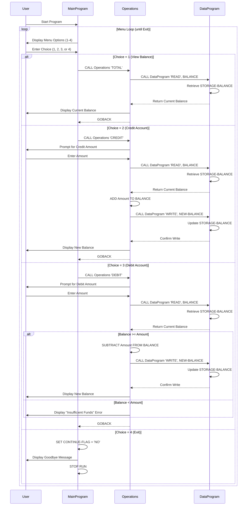

# COBOL Account Management System - Documentation

## System Overview
This system is a student account management application written in COBOL. It provides core functionality for managing student account balances through a menu-driven interface, supporting operations such as viewing balances, crediting accounts, and debiting accounts with built-in safeguards.

---

## COBOL Files Overview

### 1. **main.cob** - MainProgram
**Purpose:** Entry point and user interface controller for the account management system.

**Key Functions:**
- Displays an interactive menu with four options
- Accepts user input to select operations
- Routes user selections to the appropriate operation handlers
- Manages the main program loop with continuation control

**Menu Options:**
| Option | Operation | Description |
|--------|-----------|-------------|
| 1 | View Balance | Calls Operations program to display current account balance |
| 2 | Credit Account | Calls Operations program to deposit/add funds to account |
| 3 | Debit Account | Calls Operations program to withdraw/subtract funds from account |
| 4 | Exit | Terminates the program gracefully |

**Key Variables:**
- `USER-CHOICE` (PIC 9): Stores the user's menu selection
- `CONTINUE-FLAG` (PIC X(3)): Controls the main loop (YES/NO)

**Business Rule:** Invalid menu selections are rejected with an error message; users must select 1-4.

---

### 2. **data.cob** - DataProgram
**Purpose:** Data persistence and storage layer for student account information.

**Key Functions:**
- **READ operation:** Retrieves the current account balance from storage
- **WRITE operation:** Persists/updates the account balance to storage

**Account Storage:**
- `STORAGE-BALANCE` (PIC 9(6)V99): Default initial balance of $1000.00
  - Format: 6 digits total, 2 decimal places
  - Maximum balance: $999,999.99

**Linkage Interface:**
- Receives: `PASSED-OPERATION` (READ or WRITE) and `BALANCE` value
- Returns: Updated or retrieved balance through the `BALANCE` parameter

**Business Rules:**
- Initial account balance for new students is $1000.00
- Balance values maintain precision to two decimal places (cents)
- All balance operations route through this data module for consistency

---

### 3. **operations.cob** - Operations
**Purpose:** Core business logic module handling all account operations and transactions.

**Key Functions:**

#### View Total Balance (TOTAL)
- Retrieves current balance from DataProgram
- Displays balance to user
- Operation: READ from storage

#### Credit Account (CREDIT)
- Prompts user for amount to deposit
- Retrieves current balance
- Adds amount to balance (no limit validation)
- Writes updated balance to storage
- Displays new balance confirmation

#### Debit Account (DEBIT)
- Prompts user for amount to withdraw
- Retrieves current balance
- **Validates** sufficient funds before processing
- If balance >= amount: performs subtraction and writes to storage
- If balance < amount: displays "Insufficient funds" error message
- Displays new balance or error message

**Business Rules:**

1. **Insufficient Funds Protection:** Debit operations are rejected if the requested withdrawal amount exceeds the current balance. This prevents overdrafts.

2. **No Credit Limits:** Credit operations have no maximum limit validation; any positive amount can be credited.

3. **Precision:** All transactions maintain balance precision to two decimal places.

4. **Data Consistency:** All operations must read current balance before any transaction and write updated balance after transaction completion.

5. **Transaction Atomicity:** Each operation (TOTAL, CREDIT, DEBIT) completes fully or not at all.

**Key Variables:**
- `OPERATION-TYPE` (PIC X(6)): Type of operation to perform
- `AMOUNT` (PIC 9(6)V99): User-provided transaction amount
- `FINAL-BALANCE` (PIC 9(6)V99): Current or updated account balance

---

## Student Account Specifications

### Account Balance Format
- Data Type: Numeric with decimal places (PIC 9(6)V99)
- Range: $0.00 to $999,999.99
- Precision: 2 decimal places (cents)

### Default Initial Balance
- New student accounts start with $1000.00

### Transaction Rules

| Transaction Type | Rules | Validation |
|-----------------|-------|-----------|
| **View Balance** | Read-only operation | None |
| **Credit** | Add funds to account | No maximum limit |
| **Debit** | Subtract funds from account | Balance must be ≥ requested amount |

---

## Program Flow Diagram

```
┌─────────────────┐
│  MainProgram    │ (Entry Point)
└────────┬────────┘
         │
    ┌────▼─────────────────────────┐
    │  Display Menu & Get Choice   │
    └────┬─────────────────────────┘
         │
    ┌────▼────────────────────────────┐
    │  CASE: USER-CHOICE              │
    ├─────────────────────────────────┤
    │  1 → CALL Operations 'TOTAL'   │
    │  2 → CALL Operations 'CREDIT'  │
    │  3 → CALL Operations 'DEBIT'   │
    │  4 → EXIT                       │
    └────┬────────────────────────────┘
         │
    ┌────▼──────────────────────┐
    │  Operations Program       │
    │  (Process Transaction)    │
    └────┬─────────────────────┘
         │
    ┌────▼──────────────────────┐
    │ CALL DataProgram          │
    │ (Read/Write Balance)      │
    └────┬─────────────────────┘
         │
    ┌────▼──────────────────────┐
    │ Return to Main Menu       │
    │ (Continue Loop)           │
    └──────────────────────────┘
```

---

## Technical Notes

- **Initial Storage Value:** Each program execution starts with the default $1000.00 balance (no persistent file storage in current implementation)
- **Decimal Handling:** COBOL's implicit decimal formatting (V) ensures two decimal places are maintained
- **Error Handling:** System validates sufficient funds for debits; invalid menu choices are rejected with prompts to retry
- **Program Termination:** User-initiated exit (option 4) or program completion displays goodbye message and cleanly terminates

---

## Security & Validation Considerations

1. **Input Validation:** 
   - Menu choices validated to range 1-4
   - Transaction amounts accepted as user input (consider adding range validation)

2. **Balance Integrity:**
   - All reads use the central DataProgram module
   - All writes use the central DataProgram module
   - Prevents balance inconsistencies

3. **Overdraft Prevention:**
   - Debit operations enforce sufficient funds check
   - Withdrawal requests exceeding balance are rejected

4. **Future Enhancements:**
   - Add persistent file storage (currently in-memory only)
   - Implement transaction logging
   - Add transaction amount range validation
   - Support multiple student accounts with account IDs

---

## Data Flow Sequence Diagram

The following diagram illustrates the interaction flow between the three COBOL modules and how data flows through the system:



### Data Flow Explanation

**Module Communication:**
- **MainProgram** → **Operations**: Passes operation type (TOTAL, CREDIT, DEBIT)
- **Operations** → **DataProgram**: Passes READ/WRITE commands with balance values
- **DataProgram** → **Operations**: Returns retrieved or confirmed balance values
- **Operations** → **User**: Displays results, prompts for amounts, shows errors

**Data Elements in Transit:**
- Operation Type: 6-character string identifying the transaction
- Balance: 8-digit numeric value with 2 decimal places
- Amount: User input for credit/debit operations

**Storage Layer:**
- All persistent data (STORAGE-BALANCE) resides in DataProgram's WORKING-STORAGE
- Initial value: $1000.00
- Updated only through explicit WRITE operations from Operations module
